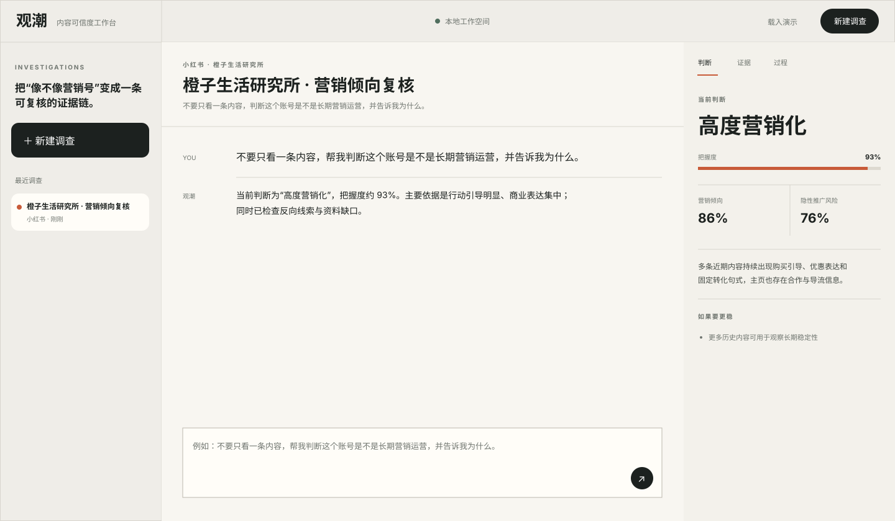

<div align="center">

# 观潮 · Guanchao

### 把“这个账号像不像营销号”变成一次可执行、可复核、会持续变准的调查

**面向小红书、微博、抖音、B站等内容平台的垂直 Agent Harness。**  
用户只说目标，观潮自己决定先查什么、如何交叉验证、什么时候需要补证，以及什么时候证据足以形成判断。


[产品](#产品是什么) · [运行方式](#一次真实调查会发生什么) · [自进化](#自进化但不失控) · [快速启动](#快速启动) · [工程结构](#工程结构)

</div>

<p align="center">
  
</p>

---

## 产品是什么

观潮不是一个“营销号分类器 + 聊天框”，也不是把一堆算法参数暴露给运营同学的检测后台。

它的基本单位是**一个持续调查任务**：用户可以说“这个账号是不是长期营销运营？”、“我怕误判，再找找反向证据”、“这一批账号先筛出最值得人工复核的”。系统会围绕目标持续保存账号资料、执行步骤、证据、判断和人工复核结果。

客户界面只呈现业务用户需要理解的内容：**任务、账号、判断、把握度、证据、待补资料、执行过程、人工复核**。内部特征、权重和策略不会出现在产品页面。

### 为什么它属于 Agent Harness，而不只是检测模型

单次分类回答的是“分数是多少”；Agent Harness 要回答的是“为了把这件事办完，下一步该做什么”。

观潮把这层执行能力做在自己的 Runtime 里：

| 能力 | 观潮如何实现 |
| --- | --- |
| 持续任务 | Case / Message / Run 持久化，同一调查可继续追问 |
| 自主决策 | `OwnedPolicy` 根据目标、资料量、置信状态和已完成步骤决定下一步 |
| 真实工具执行 | 主页核对、内容扫描、模式对照、同批比较、反向挑战、最终成案都是真实 handler |
| 结果验证 | 每一步经过 `ResultVerifier`，异常数值、缺失结论或失败结果不会被包装成成功 |
| 证据优先 | 最终判断必须携带可读证据；资料不足时明确列出缺口 |
| 反向核查 | 当把握度不足时主动寻找支持相反结论的线索，降低“先入为主” |
| 可观察 | Run Event 记录每一步为什么做、做了什么、结果如何 |
| 自进化 | 人工复核进入回放集，候选校准只有通过留出样本和回归门槛才会接纳 |

这与通用 Agent 产品的核心范式是同一层级：**session + policy + tools + execution loop + verification + state**。区别是观潮不尝试做所有事情，而是把这套运行层完整压进“内容账号调查”这个垂直领域。

> 观潮不宣称仅凭一个垂直项目就“全面超过”任何通用模型或产品。它追求的是在这个具体任务里，把通用工具调用继续推进到证据门槛、反向核查、人工反馈回放和受控自进化，从而形成更完整的垂直闭环。

---

## 一次真实调查会发生什么

给它一句目标：

> 不要只看一条内容，帮我判断这个账号是不是长期营销运营，并告诉我为什么。

Runtime 会自主推进：

1. **先读当前资料**：确认账号、近期内容、主页信息和可用互动数据；
2. **核对主页线索**：检查长期经营、合作、导流等稳定身份信息；
3. **扫描近期内容**：识别持续性的商业表达、行动引导、联系方式和转化压力；
4. **比较内容模式**：检查模板复用、固定句式、发布节奏和互动结构；
5. **必要时做反向挑战**：主动找个人化表达、明确披露和其他可能推翻判断的线索；
6. **验证后成案**：只有通过结果检查，才输出判断、把握度、关键证据和资料缺口；
7. **接收人工复核**：运营人员确认“营销运营 / 普通创作者”，复核会进入后续校准回放。

默认工具都是 **read / simulation**，不会自动执行封禁、下架、举报等平台副作用操作。

---

## 自研识别核心

观潮的核心路径不依赖外部 LLM。当前识别层由项目自身实现，组合多类相互独立的可解释信号：

- 商业与价格表达的持续密度；
- 点击、领券、下单、关注、私信等行动引导；
- 联系方式、进群、主页橱窗等导流压力；
- 多条内容的结构与句式复用；
- 发布时间的批量化与固定节奏；
- 浏览、点赞、评论、分享之间的互动形态；
- 主页简介中的长期经营线索；
- 跨内容重复出现的转化语句；
- 广告 / 赞助 / 品牌合作披露；
- 具体经历、利弊叙述和非模板化个人表达。

最终输出两个不同概念：

- **营销倾向**：这个账号是否呈现长期、系统性的商业运营内容生产方式；
- **隐性推广风险**：当营销倾向较高时，当前样本是否缺少足够清晰的商业披露。

这两个值不会混为一个“黑箱风险分”。

---

## 自进化，但不失控

观潮不会让 Agent 在生产环境里随意重写自己的源代码。

自进化发生在**可回退、可测量的校准层**：

```text
人工复核
   ↓
错误样本沉淀
   ↓
候选校准生成
   ↓
历史回放 + 留出样本
   ↓
类别回归检查
   ↓
稳定提升才接纳
```

`EvolutionEngine` 将“提出变化”和“证明变化有效”分开：候选参数可以自动产生，但是否升级由确定性回放指标决定。样本不足、留出集不完整、整体指标没有提升、任一类别明显回退，都会拒绝候选。

这让系统可以持续学习人工复核，而不会因为少量新样本把整个识别逻辑带偏。

---

## 产品 UI

视觉方向不是常见的 AI 紫色渐变 / 玻璃卡片 / 三等分模板，而是**调查工作台 + 编辑部证据桌**：暖灰纸面、墨色主文本、单一陶土橙强调色、强排版层级、少量有意义的状态动效。

桌面端采用三段式工作面：

- 左侧：持续调查与任务历史；
- 中央：对话目标、Agent 执行与结果；
- 右侧：判断 / 证据 / 过程，不和聊天气泡混在一起。

移动端自动收起任务侧栏，把输入、对话和判断变成连续阅读流。`prefers-reduced-motion` 会关闭非必要动画。

---

## 快速启动

### 1. 安装

```bash
git clone --branch guanchao --single-branch https://github.com/jiaweine/mojing-studio.git guanchao
cd guanchao

python -m venv .venv
source .venv/bin/activate
pip install -r requirements.txt
```

Windows PowerShell：

```powershell
.venv\Scripts\Activate.ps1
pip install -r requirements.txt
```

### 2. 启动产品

```bash
make run
```

打开：

```text
http://127.0.0.1:8765
```

进入页面后点击 **“载入演示”**，会跑一遍真实的 Agent 工具链，而不是播放预置动画。

### 3. 命令行演示

```bash
make demo
```

### 4. 检查

```bash
make check
```

当前检查包括 Python 全量编译、前端 JavaScript 语法与回归测试。

---

## 输入数据

API 接受平台导出的账号快照或你自己的采集结果，不内置绕过平台限制的抓取逻辑。

最小示例：

```json
{
  "platform": "xiaohongshu",
  "handle": "sample_account",
  "display_name": "示例账号",
  "bio": "主页简介",
  "followers": 12000,
  "posts": [
    {
      "id": "p1",
      "text": "近期内容文本",
      "published_at": "2026-08-12T10:00:00+08:00",
      "likes": 120,
      "comments": 8,
      "shares": 4,
      "views": 4300
    }
  ]
}
```

页面的新建调查表单支持直接“一行一条”粘贴近期内容；更完整的元数据可以走 API。

---

## API

| Method | Endpoint | Purpose |
| --- | --- | --- |
| `GET` | `/api/status` | 服务与工作空间状态 |
| `GET` | `/api/cases` | 调查任务列表 |
| `POST` | `/api/cases` | 创建调查 |
| `GET` | `/api/cases/{id}` | 获取任务、消息和执行记录 |
| `POST` | `/api/cases/{id}/messages` | 提交新目标并启动 Agent |
| `GET` | `/api/runs/{id}` | 获取当前执行状态、证据与判断 |
| `POST` | `/api/feedback` | 提交人工复核 |
| `POST` | `/api/evolution/run` | 运行一次受控校准回放 |
| `POST` | `/api/demo` | 创建并执行内置演示 |

---

## 工程结构

```text
guanchao/
├── guanchao/
│   ├── detection.py      # 自研识别与证据抽取
│   ├── policy.py         # Goal → 下一步动作
│   ├── tools.py          # 真实工具注册与执行
│   ├── verifier.py       # 每一步结果检查
│   ├── harness.py        # Agent 执行循环
│   ├── evolution.py      # 受控自进化与回归门槛
│   ├── store.py          # SQLite 会话 / 运行 / 复核持久化
│   ├── api.py            # FastAPI 与产品接口
│   ├── sample_data.py    # 可运行演示资料
│   └── cli.py            # 本地 CLI
├── frontend/
│   ├── index.html
│   ├── app.css
│   └── app.js
├── docs/
│   └── product-preview.svg
├── tests/
├── Dockerfile
├── Makefile
├── pyproject.toml
└── requirements.txt
```

---

## 设计边界

- **不把单次内容等同于账号身份。** 样本不足会降低把握度并列出缺口。
- **不把商业内容等同于违规。** “营销倾向”描述内容运营方式，不直接代表违规或恶意。
- **不做自动处罚。** 当前工具没有封禁、举报、下架等副作用动作。
- **不靠外部模型兜底。** 自研识别、任务控制、工具选择、结果验证和校准回放都在项目内部完成。
- **不把内部复杂度转嫁给客户。** 产品页面不展示内部算法名、权重或技术策略。

## License

MIT
